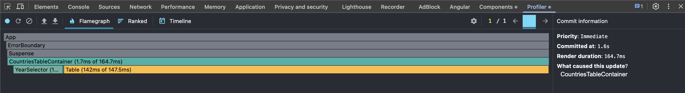
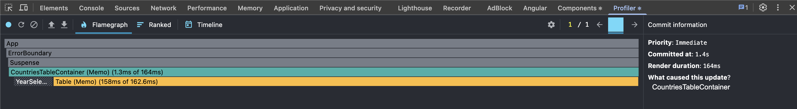
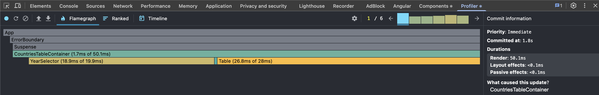
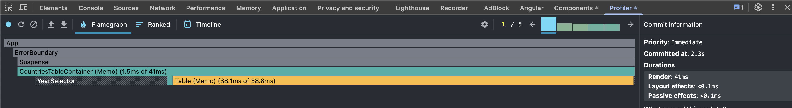
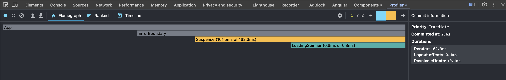
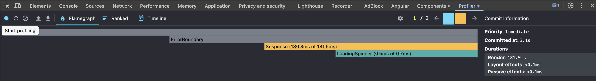
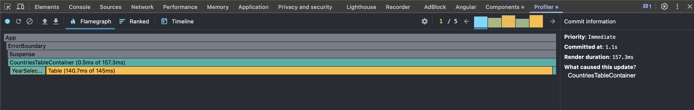
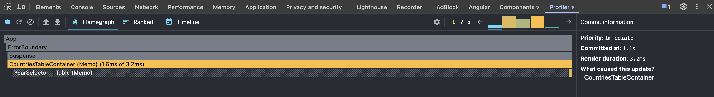

A React application for visualizing and analyzing CO₂ emissions data by country.

## Performance Profiling

Performance has been tested using React DevTools Profiler.

### Tested Interactions:
- Sorting a column without optimization


- Sorting a column after optimization


- Searching for a country without optimization


- Searching for a country after optimization


- Selecting a year without optimization


- Selecting a year after optimization


- Adding/removing columns without optimization


- Adding/removing columns after optimization


## Getting Started

### Prerequisites
- Node.js
- npm

### Installation

1. Clone the repository:
```bash
git clone https://github.com/halyna-stehnii/rs-react-app-performance.git
cd rs-react-app-performance
```

2. Install dependencies:
```bash
npm install
```

3. Start the development server:
```bash
npm run dev
```

4. Open [http://localhost:5173](http://localhost:5173) to view it in the browser.

5. Commit: 6a7a7d4fd35ba56a2720e9a42e56546e3969f79c - final project before optimization

6. The last commit - final project after optimization
